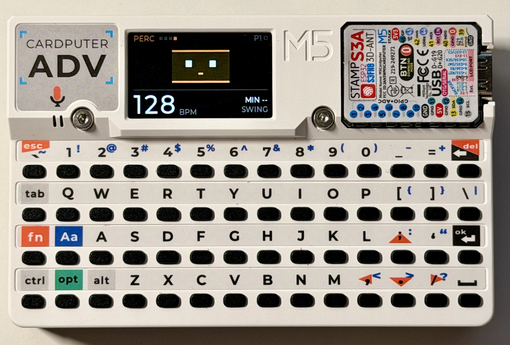
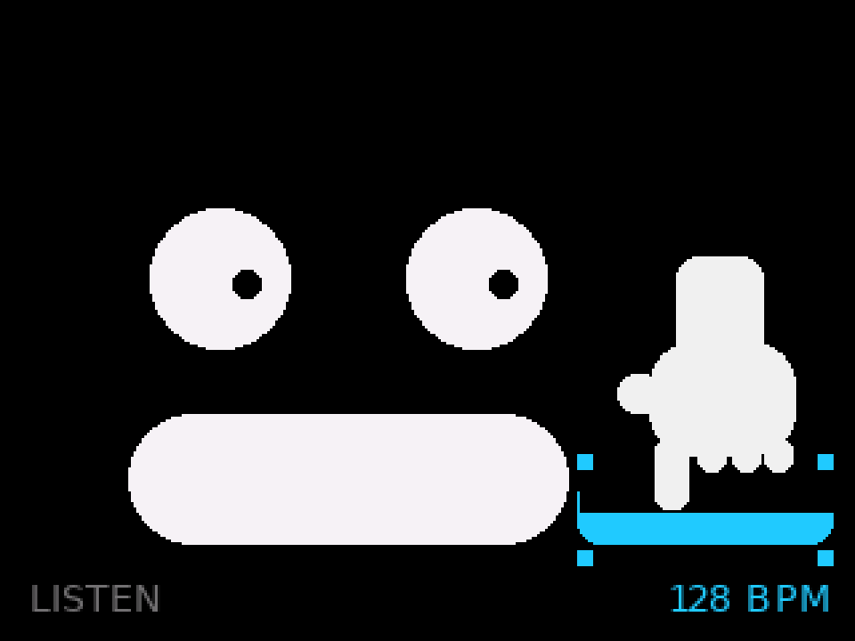

# OP-CP

**A pocket step sequencer for the M5Stack Cardputer-ADV** — four tracks, sixteen
steps, a PCM synth, and a piano hiding in the keyboard. UIFlow2 MicroPython.



*The FACE view on PERC at 128 bpm. The middle two keyboard rows are the piano —
you can see the black keys sitting in the physical gaps above the home row.*

| | | |
|:--:|:--:|:--:|
|  |  |  |
| the roll | RING | BARS |

> ### Built with [`vibe-uiflow`](https://github.com/luckiday/vibe-hardware/tree/main/skills/vibe-uiflow)
>
> This repo is the worked example for **vibe-uiflow**, a skill for building
> screen-and-buttons devices on UIFlow2/MicroPython with an AI coding agent
> driving the loop. The skill is the *method* — two loops, the ghost check, the
> rules, and the platform facts that cost a debugging session each. This is the
> method actually running on hardware, and every measurement quoted in the skill
> came off this board.
>
> It sits beside [`vibe-firmware`](https://github.com/luckiday/vibe-hardware/tree/main/skills/vibe-firmware)
> (C/ESP-IDF) in [**vibe-hardware**](https://github.com/luckiday/vibe-hardware) —
> a set of skills for taking small hardware from a brief to a built thing, across
> firmware, PCB and enclosure.

## Build and run

Requires an M5Stack Cardputer-ADV with UIFlow2 firmware (M5Burner installs it;
`make probe` confirms what you have) and Python 3 on the host.

```bash
make venv       # mpremote, mpy-cross and esptool into .venv/
make check      # compile, upload, run the self-test on the board, read it back
make deploy     # install as main.py — starts on power-up
```

`make check` is the gate: it compiles every module with `mpy-cross`, uploads,
runs `selftest.py` **on the board**, and prints the result. A change is not done
until it passes.

```bash
make shots      # render every screen on the host, run the ghost check, look
```

`make shots` renders the program's *own* draw functions against a Pillow-backed
`M5` stub — with font metrics measured off the real device — and then diffs 40
live animation frames against a clean redraw to prove nothing was left behind.

Full target list in [docs/development.md](docs/development.md#targets).

## Results

The self-test found four layout bugs on its first run; the simulator found a
green cast on every dark grey (`0x0E0E0E` quantises to `rgb(8,12,8)` on RGB565);
the ghost check found two sparks that had never been erased since the feature was
written.

Frame cost on the panel, against a 55 ms budget — after switching from
"clear the band and redraw" to "erase only the box you are about to paint":

| animated view | before | after |
|---|---|---|
| FACE | 9.8 ms | **6.2 ms** |
| RING | 8.3 ms | **3.2 ms** |
| BARS | 16.5 ms | **1.7 ms** |

The surprise underneath those numbers: **text is the expensive primitive.** Four
4-character `drawString`s cost 7.6 ms — more than clearing the entire 240×69
animation band (6.8 ms), and six times four bar-column fills (1.2 ms). Caching
the labels is what made BARS fast, not touching the fills.

Step clock, measured under real playback: median 1 ms late, p90 2 ms, max 3 ms
against a 133 ms sixteenth. Heap floor over ~1350 frames of playback with the PCM
kit resident: ~36 KB, no `MemoryError`.

## Companion: SCD, the dancer

[`dance/`](dance/) is **StackChan Dance** — the other half of the desk. OP-CP
plays; SCD listens with its own microphone, finds the beat, and dances to it.
`^N` broadcasts every step over ESP-NOW, so when the radio is up SCD dances from
ground truth instead of from the room, and falls back to the microphone the
moment it goes quiet. Neither needs the other to be useful.


*The whole desk. OP-CP in the middle; below it the cube in **LINK**, dancing
from OP-CP's ESP-NOW packets at 128 bpm on a green palette; above, the StackChan
held in **STILL** — head settled, face carrying on.*

| | |
|:--:|:--:|
|  |  |
| a 240×240 cube — it claps | a CoreS3 on a StackChan base — a hand on a drum pad, plus two servos and twelve LEDs |

It is one program running on two very different machines, with **nothing at
runtime asking which one it is on**: the difference lives in
`boards/<board>/scd_board.py` and `make BOARD=…` copies exactly one of them to
the device under the same name. One of those boards is not an M5Stack product at
all — see [dance/README.md](dance/README.md) for how UIFlow2 gets onto it.

It shares this repo's toolchain: `make venv` here, then `make check BOARD=…`
in `dance/`.

## Companion: tiny-MHS, the agent layer

OP-CP is also the canonical instrument of
[**tiny-MHS**](https://github.com/ToyWorks/tiny-mhs) — a minimal standard for
describing hardware to a language model, which vendors this repo as a
submodule and drives it **without modifying a line of it**. The properties
that make that possible are deliberate here and worth naming: `app.py` stays
importable, modules import strictly one way, and the keyboard is just one
caller among possible others — so a sibling layer can sit where `opcp_keys`
sits and give an agent the same seat. Over there, an agent discovers the
sequencer from its self-description, composes its own sixteen-step patterns,
arranges bank-chains into a set, and gets refused in prose when it asks for
more gain than the enclosure can honestly use.

## Documentation

| | |
|---|---|
| [instrument.md](docs/instrument.md) | the manual — keybed, tracks, sound, files, link |
| [screens.md](docs/screens.md) | every view, rendered |
| [development.md](docs/development.md) | the two loops, the ghost check, frame costs, `make` targets |
| [architecture.md](docs/architecture.md) | module layering, redraw discipline, timing |
| [uiflow2-notes.md](docs/uiflow2-notes.md) | measured firmware and platform facts |
| [dance/README.md](dance/README.md) | the companion module, and UIFlow2 on a non-M5 board |

[CLAUDE.md](CLAUDE.md) is the short rulebook an AI coding agent reads before
touching this repo. The one rule worth repeating here: **confirm an M5 API exists
before calling it** — inventing a plausible method is the most common way UIFlow2
code fails.

## License

MIT — see [LICENSE](LICENSE).
