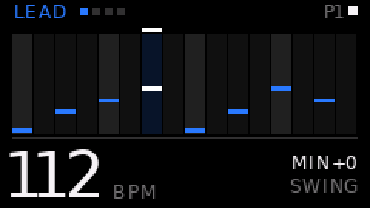
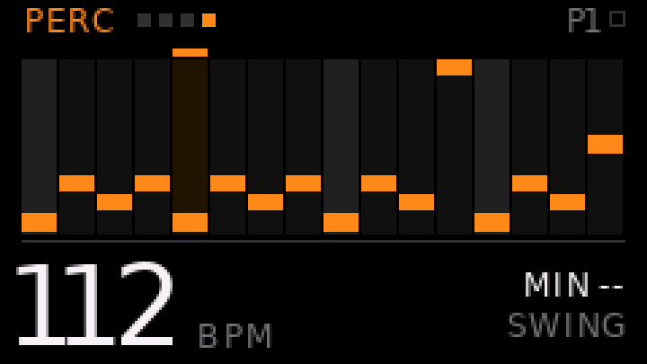
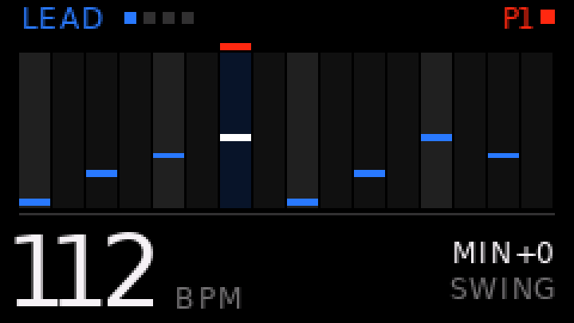
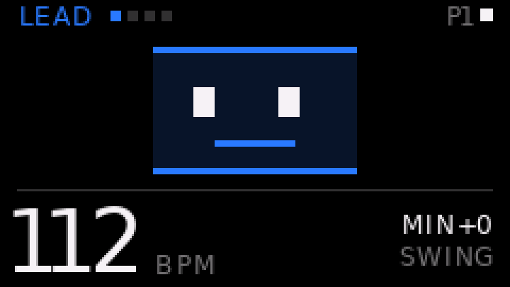
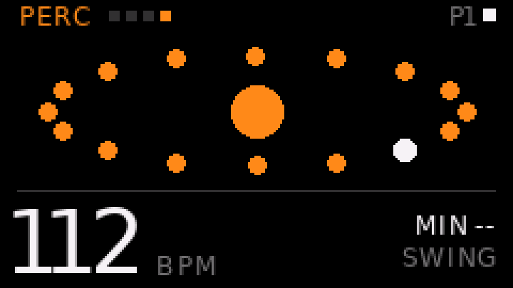
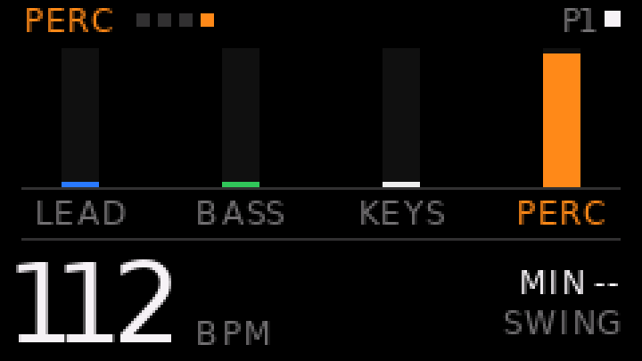
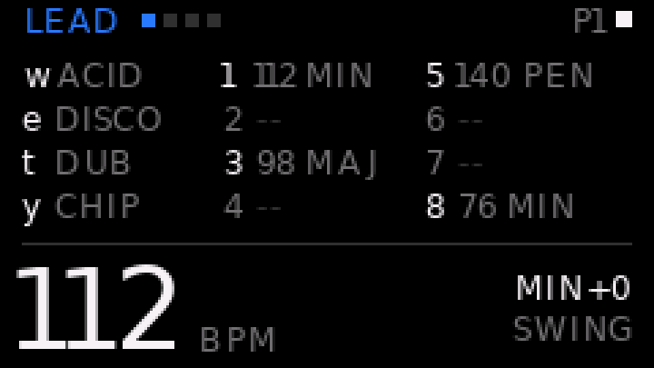
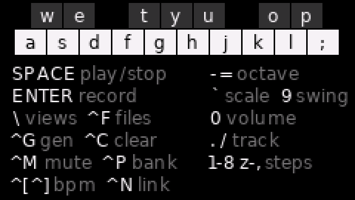

# OP-CP

**A pocket step sequencer for the M5Stack Cardputer-ADV** — four tracks, sixteen
steps, a PCM synth, and a piano hiding in the keyboard. Written in UIFlow2
MicroPython.



It comes with the thing that made it possible to build: a workflow where **a
change is verified without a human watching the screen**. That half is reusable
for any UIFlow2 project — see [Two loops](#two-loops).

---

## The instrument

The middle two keyboard rows are a piano — white keys on the home row, black keys
in the physical gaps above them:

```
     w e   t y u   o p          black keys
    a s d f g h j k l ;         white keys   C D E F G A B C D E

1 2 3 4 5 6 7 8                 steps 1-8
z x c v b n m ,                 steps 9-16
```

Those two rows are **nothing but piano**. Every function that used to squat
between the keys lives on a ctrl layer now, so a missed black key can no longer
wipe a track:

```
SPACE play/stop      ENTER record arm (live, quantized to 16ths)
^G generate  ^C clear  ^M mute  ^P pattern bank  ^[ ^] tempo  ^F files  ^N link
- = octave   ` scale   9 swing  0 volume   . / track   \ next view
```

Four tracks — LEAD, BASS, KEYS, PERC — colour-coded with OP-1's four encoder
colours, which double as the colours of the four parameter slots along the bottom.

**Sound** is signed-16-bit PCM, not `tone()` beeps: `M5.Speaker.tone()` is a bare
square wave with no envelope, one timbre, drums as pure tones. The kit is
synthesised **on the host** by `make kit` into `lib/opcp_kit.bin` and played with
`playRaw` — one buffer per melodic track, replayed at `rate * 2**(semitones/12)`
to pitch it. Rendering it on the device took 5.4 s, which is no way to boot.

**Files** (`^F`) is eight save slots plus four factory patterns — ACID, DISCO,
DUB, CHIP. Slots live on the SD card when one is in and `/flash` otherwise, so
patterns survive a firmware reflash. Every entry is labelled with the key that
fires it; there is no cursor.

**Link** (`^N`, on by default) broadcasts each step over ESP-NOW — 9 bytes: step,
per-track hit bitmask, drum index, bpm — so a companion device can dance from
ground truth rather than listening to the room. Connectionless; costs nothing
when nobody is listening.

## The screens

`\` cycles them. The pattern is drawn as a piano roll with pitch encoded as
height: sixteen steps in one row instead of two, the shape of a phrase legible
without reading any text, and no text in a 14 px column.

| | | |
|:--:|:--:|:--:|
|  |  |  |
| the roll, PERC | record armed | FACE |
|  |  |  |
| RING | BARS | FILES |



Every one of these is a render of the program's **own draw functions**, not a
mock — see below. [All screens on one sheet](docs/screens/all-screens.png).

---

## Two loops

UIFlow2 firmware is ordinary MicroPython, so `mpremote` is the whole toolchain —
and `mpremote run` sends stdout and tracebacks back to the terminal. That makes
two cheap loops possible, and neither replaces the other.

```bash
make check
```

compiles every module with `mpy-cross`, uploads, runs `selftest.py` **on the
board**, and prints the result. It is a report, not an assertion suite: it prints
the numbers a human would otherwise read off the screen, then asserts on them.
Every computed rectangle lands inside the 240×135 panel, regions do not overlap,
every string fits its box, all four tracks × 49 key bindings dispatch without
raising, the transport advances, save/load round-trips, memory headroom remains.
It found four real layout bugs on its first run — three drum labels overflowed
their step cell, and the help page ran 47 px past the bottom of the screen.

```bash
make shots
```

renders every screen to `sim/shots/` by running the program's own draw functions
against a Pillow-backed `M5` stub — with **font metrics measured off the real
device**, so a centred string lands on the same pixel it does on the panel, and
colour quantised through RGB565 the way the panel does.

It caught what a headless test cannot: the parameter strip drowning out the
sequence, the total absence of type hierarchy, a playhead mark floating detached
above its column, and a **green cast on every dark grey** — `0x0E0E0E` quantises
to `rgb(8,12,8)` on an RGB565 panel, so the greys are all multiples of `0x10` now.

`make shots` also runs a **ghost check**: it drives each animated view 40 frames
with no clearing in between, then diffs the result against the same state drawn
onto a clean screen. Any difference is a pixel some element failed to erase, and
it fails the build with coordinates. That matters because the views deliberately
*do not* clear themselves each frame — clearing a region and then painting into
it is exactly what flicker is, so each one erases only the box it is about to
paint over. The check found a long-standing bug on its first run, then caught a
new one going the other way (an erase box wide enough to bite its neighbour).

Panel gamma, backlight, viewing angle — and taste — are still human questions.

### What a frame costs

Measured on the panel, for the 240×69 animation band:

| primitive | cost |
|---|---|
| 4× `drawString`, 4 characters each | **7.6 ms** |
| `fillRect` over the whole band | 6.8 ms |
| `fillRect` over a 128×52 box | 2.8 ms |
| 4× `fillRect` over a bar column | 1.2 ms |
| 4× `textWidth` | 0.07 ms |

**Text is the expensive primitive** — four short strings cost more than clearing
the entire band, which is not what you would guess. Against a 55 ms frame budget
the three animated views now cost 6.2 ms (FACE), 3.2 ms (RING) and 1.7 ms (BARS,
with a steady selection), down from 9.8 / 8.3 / 16.5.

---

## Getting it running

You need an M5Stack Cardputer-ADV with UIFlow2 firmware on it (M5Burner installs
that; `make probe` confirms what you have).

```bash
make venv     # mpremote, mpy-cross and esptool into .venv/
make check    # compile, upload, self-test on the board
make deploy   # install as main.py — starts on power-up
```

The serial port is found by matching the board's USB **product** string, so a
second `/dev/cu.usbmodem*` from a monitor, a dock or another M5 board does not
confuse it.

| target | what it does |
|---|---|
| `make check` | compile + upload + run the self-test on hardware + read back |
| `make shots` | render every screen to `sim/shots/`, run the ghost check, and look |
| `make kit` | rebuild `lib/opcp_kit.bin` after tuning sounds in `opcp_synth` |
| `make audio` | render the kit to WAV on the host, old vs new, then listen |
| `make metrics` | re-dump font metrics from the board after a firmware update |
| `make run` | run `app.py` live; tracebacks return here, Ctrl-C stops |
| `make deploy` / `undeploy` | install as `main.py` and reboot / remove it |
| `make probe` | dump the API surface this firmware actually has |
| `make api OBJ=M5.Lcd` | list one object's attributes |
| `make repl` / `ls` / `mem` / `reset` / `port` | the usual |

## How it is put together

`app.py` is the lifecycle and nothing else — 121 lines. State lives in one
object, `S`, so modules share it without threading arguments everywhere, and
imports run strictly one way:

```
opcp_conf -> opcp_state -> opcp_audio / opcp_ui -> opcp_screen -> opcp_seq -> opcp_keys -> app
```

`lib/*.py` deploys **flat, next to `main.py`** — the device has no `/flash/lib`
on `sys.path`, so a subdirectory would upload fine and then fail to import.

[CLAUDE.md](CLAUDE.md) is the rulebook that keeps both loops honest, and is worth
reading before changing anything. The important rule: **confirm an M5 API exists
before calling it**, since inventing a plausible method is the most common way
UIFlow2 code fails.

## License

MIT — see [LICENSE](LICENSE).
