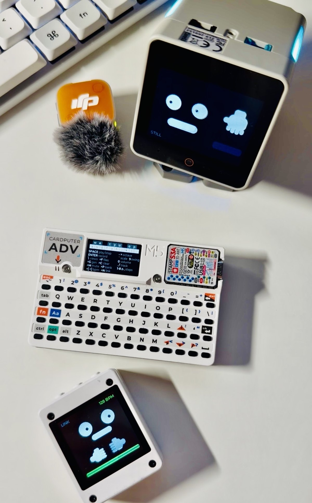
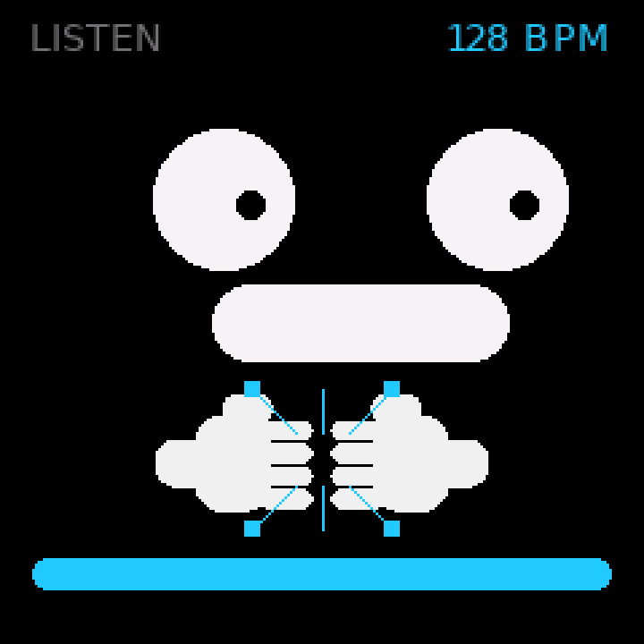
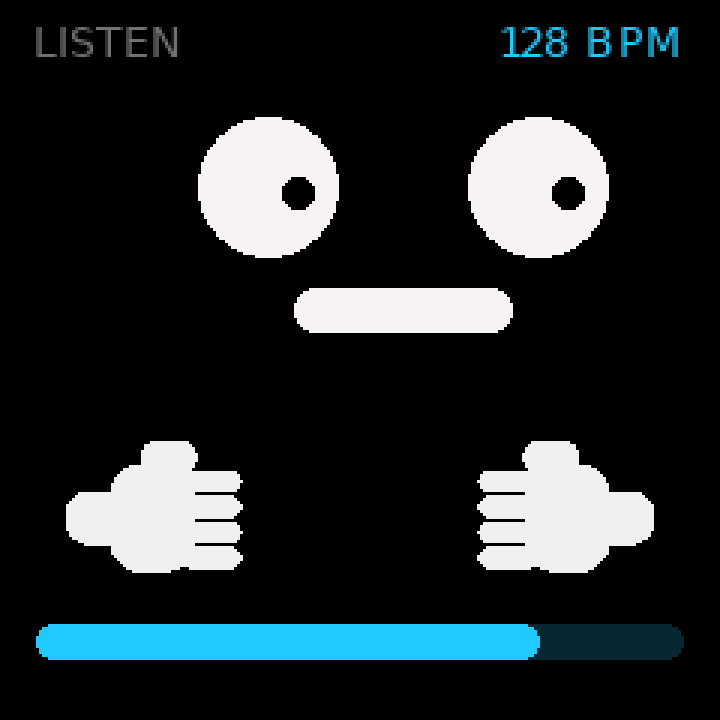
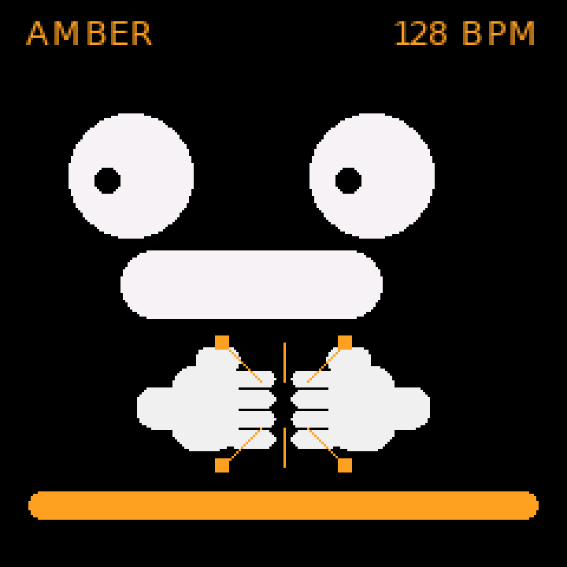

# SCD — StackChan Dance

**OP-CP's dance partner.** The Cardputer across the desk plays; this board
listens with its own microphone, finds the beat in what it hears, and dances.

Sound is the whole protocol — no radio, no pairing, no clock to share. Anything
rhythmic works; the OP-CP kit just happens to live on the same desk. When OP-CP's
ESP-NOW step packets *are* arriving it dances from ground truth instead, and
hands the dance back to the microphone the moment the radio goes quiet.



*All three, live. The Cardputer-ADV in the middle is OP-CP — here on its help
page. Below it the cube is in **LINK**, dancing from OP-CP's ESP-NOW packets at
128 bpm with the palette walked round to green. Above, the StackChan has been
put in **STILL** by holding its touch strip: the head has stopped marking the
beat and settled, and the face carries on.*

| | |
|:--:|:--:|
|  |  |
| the cube, listening | …and on the beat |

## One program, two machines

It runs on two very different boards, and **nothing at runtime asks which one it
is on**:

| `make BOARD=` | board | what it has |
|---|---|---|
| `cores3` | M5Stack CoreS3 on a StackChan base | 320×240, ES7210 mic, two servos, twelve LEDs, a touchpad |
| `cube` | XINGZHI / xiaozhi-cube 1.54 | 240×240 ST7789, an I²S MEMS mic, two buttons, no body |

`app.py` and `lib/` are byte-identical on both. Everything that differs lives in
`boards/<board>/scd_board.py`, and the Makefile copies exactly **one** of them to
the device *under the same name*. The decision is made by the build, not by an
`if`.

That freed the two screens to be genuinely different rather than one scaled:

| | |
|:--:|:--:|
|  |  |
| **320×240** — the face sits left, a hand plays a drum pad in the right column | **240×240** — no room for that column, so the square **claps**: two palms under a flatter face, driven together by the beat's own decay |

The cube has no LED strips either, so its drum pad becomes a slim bar along the
bottom that doubles as the VU meter. Its top button walks an accent palette —
and the accent is still the only saturated colour on screen, because each entry
is one hue at two brightnesses rather than a second colour appearing:



## Controls

| | CoreS3 + StackChan base | cube |
|---|---|---|
| next colour | tap the **screen** | top side button (GPIO39) |
| LISTEN / MIC ONLY | tap the **touch strip** | the button below it (GPIO40) |
| **STILL** — stop the body | **hold** the touch strip, 0.8 s | — (no body to still) |

A hold fires the moment it crosses the threshold rather than on release, so the
feedback lands while your finger is still down; the release is then swallowed so
one gesture is never also counted as a tap.

**STILL** stops the head and rests it — settled and unpowered, which is the
quiet part — while the face dances on. It is the servos that are distracting,
not the screen. The corner reads `STILL` until you hold again.

GPIO0 (BOOT) is deliberately unbound on the cube: it is the download-mode
strapping pin, so a feature there would hand you a black screen.

## Run it

The toolchain venv is OP-CP's, one directory up — run `make venv` there first.

```bash
make boards                # what is attached, and the BOARD= name for each
make check BOARD=cube      # compile + upload + self-test on hardware
make shots BOARD=cube      # render the face on the host, ghost check, look
make deploy BOARD=cube     # install as main.py, start on power-up
```

`make compile-all` syntax-checks *both* boards' halves without a board attached.
Keep one board plugged in at a time: they enumerate on the same port name, and
`make boards` matches on the USB product string.

## The one that makes this reusable

The cube is **not an M5Stack product and has no UIFlow2 build**. It runs UIFlow2
anyway:

- **Flash the StampS3 image** — the only UIFlow2 build that is a *bare* ESP32-S3,
  with no panel, PMIC or codec for `M5.begin()` to hunt for and hang on.
- **Drive the panel with `M5.UserDisplay`** — a full LovyanGFX device you hand a
  panel type and a pin list, returning the same drawing surface `M5.Lcd` is, so
  the face moved across unchanged. (Not `M5.addDisplay`, which only knows M5's
  own units.)
- **Do not expect `M5.Mic` to work.** M5Unified drives I²S at 16 bits and this
  mic puts 24-bit samples MSB-aligned in 32-bit slots, so it returns a DC level
  that does not move when you play music at it. `machine.I2S(bits=32,
  format=MONO)` does.

Pin maps for a great many cheap ESP32 boards already exist in
[`xiaozhi-esp32`](https://github.com/78/xiaozhi-esp32)'s
`main/boards/*/config.h`. Copying one and confirming it on the bench took under
an hour.

Full detail, including the boot traps that make a board look hung when it simply
never started, is in [CLAUDE.md](CLAUDE.md).

## Verified

Both boards, on hardware:

- **cube** — self-test passes; a cold boot reaches `main.py`; 30 s of a 120 bpm
  kick played across the room gives 63 beats with the tempo readout locked at
  117–120.
- **cores3** — self-test passes; the servos follow a +10° yaw nudge and a +6°
  rise, the clamps hold, the LED strips fill.

A **sustained tone is a bad test signal**: 250 ms beeps at 120 bpm read as ~85,
because each beep produces more than one onset. A kick with a real transient
locks exactly.
