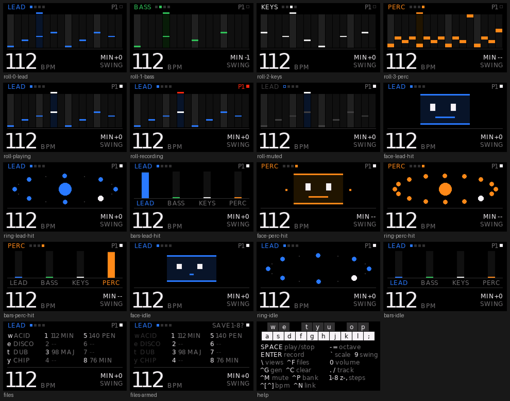

# The screens

`\` cycles them: roll → face → ring → bars → files → help.

Every image here is a render of the program's **own draw functions** against the
host simulator — not a mock, and not a photograph. They are the same artifact the
development loop produces, so they cannot drift from what the panel shows.
Regenerate with `make shots`. See [development.md](development.md#the-host-loop).

## Roll

The pattern is drawn as a piano roll with **pitch encoded as height**. That fits
sixteen steps in one row instead of two, makes the shape of a phrase legible
without reading any text, and takes text out of a 14 px column entirely.

| | |
|:--:|:--:|
|  |  |
| LEAD, playing | PERC — drum indices, not pitches |

Record arm turns the header red; live input quantises to 16ths.

## Face · Ring · Bars

Three ways to watch the same thing when you would rather not read a grid.

| | | |
|:--:|:--:|:--:|
|  |  |  |
| FACE — one flat shape driven entirely by the music | RING — the sixteen steps as a loop the playhead runs around | BARS — four channel meters |

These three animate at ~18 fps and are where the redraw discipline in
[development.md](development.md#what-a-frame-costs) matters.

## Files and help

| | |
|:--:|:--:|
|  |  |
| FILES — presets, then two columns of slots | HELP — a poster, not a mode |

Help draws the keybed itself, so the piano layout is legible without a manual.
No track colour appears on it: everywhere else a lit colour means "the track you
are editing", and help must not dilute that.

## Everything at once

